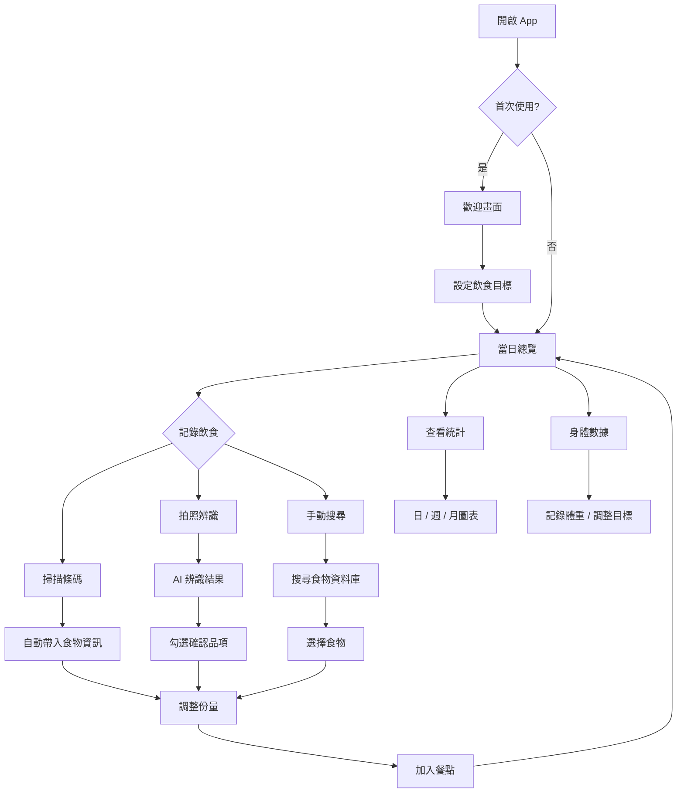

# ADR-001: App 整體操作流程

- **狀態**: Proposed
- **日期**: 2026-06-18
- **關聯**: [ADR-002](ADR-002-client-server-architecture.md), [ADR-003](ADR-003-ai-food-recognition-pipeline.md)

## Context

食誌（Foodie Notes）是一款飲食記錄 App，核心功能包括 AI 食物辨識、營養追蹤、身體數據管理。需要定義使用者從開啟 App 到完成飲食記錄的完整操作流程，作為後續開發的依據。

## Decision

### 主要操作路徑

#### 1. 首次使用

```
歡迎畫面 → 設定飲食目標 → 進入當日總覽
```

- **歡迎畫面**：介紹 App 三大特色（Eat · Log · Reach）
- **設定飲食目標**：輸入身高、目前體重、目標體重、目標日期，系統自動計算每週建議減重幅度與每日熱量目標

#### 2. 日常飲食記錄

使用者可透過三種方式記錄飲食：

| 方式 | 適用情境 | 流程 |
|------|----------|------|
| 掃描條碼 | 包裝食品 | 掃描 → 自動帶入食物資訊 → 調整份量 → 加入餐點 |
| 拍照辨識 | 自助餐、便當等 | 拍照 → AI 辨識 → 勾選確認品項 → 調整份量 → 加入餐點 |
| 手動搜尋 | 已知食物名稱 | 搜尋食物資料庫 → 選擇食物 → 調整份量 → 加入餐點 |

#### 3. 查看統計

- **日檢視**：24 小時時間軸，顯示各餐時間點與熱量
- **週檢視**：長條圖呈現 7 天攝取量，含目標線
- **月檢視**：整月長條圖，含達標率、體重變化、最常吃食物

#### 4. 身體數據管理

- 記錄每日體重
- 檢視減重進度（已減 / 剩餘）
- 調整目標體重與日期

### 底部導覽列

5 個 Tab 對應主要功能區：

| Tab | 功能 | 畫面 |
|-----|------|------|
| 今日 | 當日飲食總覽 | 熱量進度、三大營養素、餐點列表 |
| 統計 | 日 / 週 / 月數據 | 圖表、趨勢分析 |
| 掃描 | 條碼 / 拍照 / 搜尋入口 | 相機介面（Modal 覆蓋） |
| 食物 | 食物資料庫搜尋 | 搜尋、最近吃過、自定義食物 |
| 我的 | 身體數據與設定 | 體重進度、目標管理 |

### 操作流程圖



## Consequences

### 優點

- 三種記錄方式覆蓋主要使用情境，降低記錄門檻
- AI 辨識搭配勾選確認，兼顧效率與準確度
- 底部導覽列提供快速切換，符合行動裝置操作習慣

### 缺點

- 掃描與 AI 辨識需要網路連線，離線時僅能手動搜尋本地資料
- 首次使用需要填寫較多資料，可能影響 onboarding 完成率

### 待決定事項

- [ ] 掃描條碼的資料來源（Open Food Facts / 自建資料庫）
- [ ] 離線模式下的功能降級策略
- [ ] 是否支援語音輸入作為第四種記錄方式
