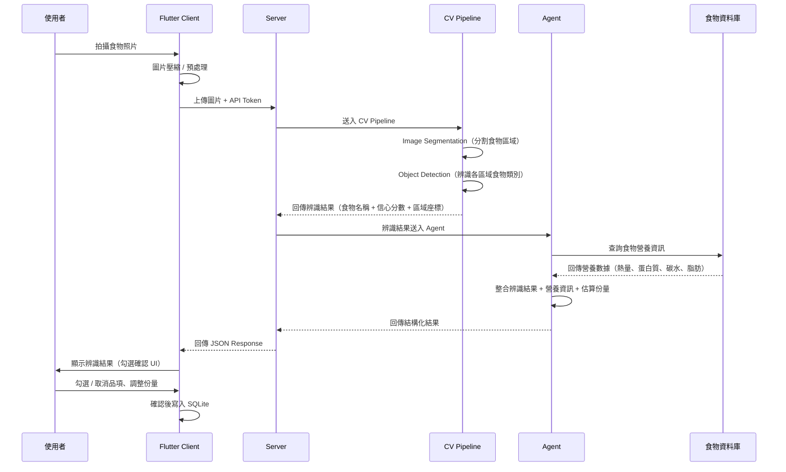

# ADR-003: AI 飲食辨識流程

- **狀態**: Proposed
- **日期**: 2026-06-18
- **關聯**: [ADR-001](ADR-001-app-user-flow.md), [ADR-002](ADR-002-client-server-architecture.md)

## Context

食誌 App 的核心功能之一是透過拍照自動辨識食物品項與營養資訊，降低使用者手動記錄的門檻。辨識涉及電腦視覺（Image Segmentation、Object Detection）與營養資料庫比對，運算量大且模型需持續更新，因此決定由後端處理。

## Decision

### 辨識流程

AI 辨識由後端 Server 執行，流程如下：

```
Client 拍照 → 上傳圖片 → Server 接收
  → Image Segmentation（影像分割）
  → Object Detection（物件偵測）
  → Agent 整合辨識結果與營養資料庫
  → 回傳結構化結果給 Client
  → Client 顯示勾選確認 UI
```

### 流程圖



### 各階段說明

#### 1. Client 端（Flutter）

- 拍照或從相簿選取圖片
- 圖片壓縮與預處理（降低上傳大小）
- 上傳至 Server，附帶 API Token 進行身份驗證
- 顯示辨識結果，提供勾選確認 UI
- 使用者可修改辨識結果（新增、刪除、調整份量）

#### 2. CV Pipeline（電腦視覺）

| 步驟 | 技術 | 輸出 |
|------|------|------|
| Image Segmentation | 影像分割 | 將圖片中的食物區域分離出來 |
| Object Detection | 物件偵測 | 辨識每個區域的食物類別與信心分數 |

#### 3. Agent

- 接收 CV Pipeline 的辨識結果
- 查詢食物資料庫，取得對應的營養資訊
- 估算份量（依據圖片中食物區域的相對大小）
- 整合為結構化結果回傳
- **Prompt 可動態調整**：Agent 的 prompt 為可配置設計，未來可透過調整 prompt 改變辨識行為（如：輸出格式、份量估算邏輯、營養計算方式），無需修改程式碼

#### 4. 回傳結果格式（草案）

回傳結果包含整餐資訊，每個品項帶有 `selected` 欄位供 Client 端勾選確認 UI 使用：

```json
{
  "meal_name": "雞排便當",
  "detected_count": 3,
  "items": [
    {
      "id": "item_001",
      "name": "白飯",
      "calories": 65,
      "protein": 2,
      "carb": 15,
      "fat": 0,
      "quantity": 1,
      "unit": "份",
      "weight_g": 50,
      "confidence": "high",
      "selected": true,
      "source": "tfda"
    },
    {
      "id": "item_002",
      "name": "雞排",
      "calories": 250,
      "protein": 20,
      "carb": 10,
      "fat": 15,
      "quantity": 1,
      "unit": "份",
      "weight_g": 100,
      "confidence": "high",
      "selected": true,
      "source": "tfda"
    },
    {
      "id": "item_003",
      "name": "炒青菜",
      "calories": 45,
      "protein": 2,
      "carb": 4,
      "fat": 2,
      "quantity": 1,
      "unit": "份",
      "weight_g": 50,
      "confidence": "medium",
      "selected": false,
      "source": "tfda"
    }
  ],
  "summary": {
    "total_calories": 360,
    "total_protein": 23,
    "daily_calories_pct": 18,
    "daily_protein_pct": 23
  }
}
```

#### 5. 欄位說明

| 欄位 | 說明 |
|------|------|
| `meal_name` | Agent 根據辨識結果推測的整餐名稱（如「雞排便當」） |
| `detected_count` | 辨識出的食物品項數量 |
| `items[].id` | 品項唯一識別碼，用於 Client 端勾選操作 |
| `items[].confidence` | 辨識信心等級：`high` / `medium` / `low` |
| `items[].selected` | 預設勾選狀態，`high` 信心自動勾選，`medium` / `low` 預設不勾選 |
| `items[].weight_g` | 估算重量（克），用於營養計算基準 |
| `summary` | 僅計算 `selected: true` 的品項總和 |
| `items[].source` | 營養資料來源：`tfda` / `off` / `fatsecret` / `user`（詳見 [ADR-002](ADR-002-client-server-architecture.md#食物資料庫來源)） |
| `summary.daily_*_pct` | 佔每日目標的百分比，依使用者設定的目標計算 |

> **設計考量**：Agent prompt 可動態調整，未來可透過修改 prompt 改變 `confidence` 判定閾值、`selected` 預設邏輯、`meal_name` 推測方式等行為，無需更動程式碼。

## Consequences

### 優點

- **模型可持續改善**：Server 端更新模型不需要使用者更新 App
- **不受手機算力限制**：複雜的 CV 模型在 Server 執行，支援各種機型
- **Agent 彈性高**：可結合多種資料來源（食物資料庫、歷史辨識結果）提升準確度
- **勾選確認機制**：使用者最終確認辨識結果，確保記錄準確性

### 缺點

- **需要網路連線**：離線時無法使用 AI 辨識，需 fallback 到手動搜尋
- **有延遲**：圖片上傳 + 辨識處理需要數秒，需設計 loading 狀態
- **辨識失敗處理**：低信心分數或無法辨識時，需引導使用者手動輸入
- **Server 成本**：CV 模型推論需要 GPU 資源，需考慮成本控制

### 待決定事項

- [ ] CV Pipeline 技術選型（YOLO / Segment Anything / 其他）
- [ ] Agent 實作方式（LLM-based / Rule-based / 混合）
- [ ] 圖片上傳大小限制與壓縮策略
- [ ] 辨識失敗時的 fallback UX 流程
- [ ] 是否支援多張圖片同時辨識
- [ ] 辨識結果的快取策略（相似圖片是否複用結果）
- [ ] 份量估算的準確度目標與改善方式
