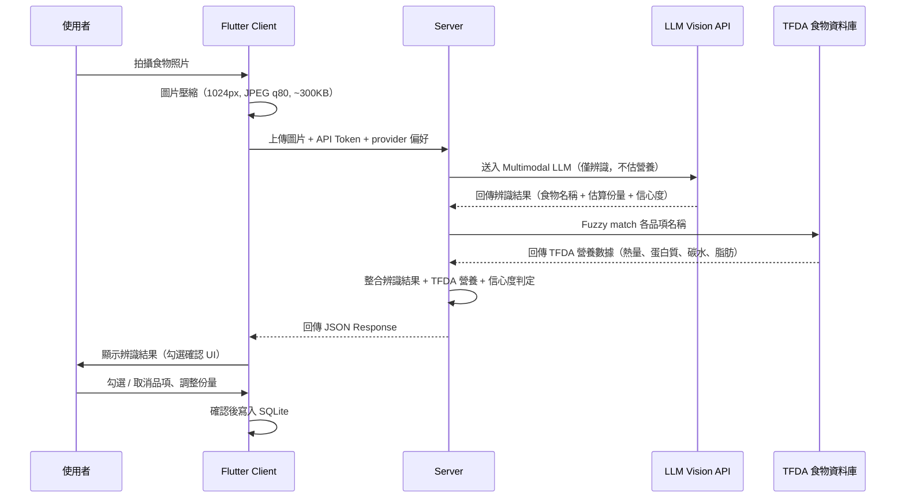

# ADR-003: AI 飲食辨識流程

- **狀態**: Revised
- **日期**: 2026-06-20（原始: 2026-06-18）
- **關聯**: [ADR-001](ADR-001-app-user-flow.md), [ADR-002](ADR-002-client-server-architecture.md)

## Context

食誌 App 的核心功能之一是透過拍照自動辨識食物品項與營養資訊，降低使用者手動記錄的門檻。

原方案設計了傳統 CV Pipeline（Image Segmentation → Object Detection → Agent），但經過技術評估後，考量以下因素改為混合 LLM 方案：

1. **Multimodal LLM 已達實用水準**：GPT-4o、Claude、Gemini 等 Vision Model 可直接辨識食物圖片，包括亞洲料理
2. **CV Pipeline 基礎設施門檻高**：YOLO/SAM 需要 GPU 推論，與 Zeabur (CPU PaaS) 部署環境矛盾
3. **台灣食物訓練資料不足**：預訓練 CV 模型缺乏台灣在地食物標註，需自行訓練
4. **營養數據可靠性**：LLM 會幻覺營養數字，必須以 TFDA 權威資料庫為準

## Decision

### 架構：混合 LLM + TFDA Grounding

採用「LLM 辨識 + 資料庫比對」的混合架構。核心原則：**LLM 負責「看」（辨識食物品項），TFDA 負責「算」（提供營養數據）。永遠不信任 LLM 提供的營養數字。**

```
Client 拍照 → 壓縮上傳 → Server 接收
  → Multimodal LLM 辨識食物品項（僅辨識名稱 + 估算份量，不回傳營養）
  → TFDA 資料庫 fuzzy match（取得權威營養數據）
  → 整合辨識結果 + TFDA 營養資訊
  → 回傳結構化結果給 Client
  → Client 顯示勾選確認 UI
```

### 流程圖



### 各階段說明

#### 1. Client 端（Flutter）

- 拍照或從相簿選取圖片
- 圖片壓縮與預處理：縮至 1024px，JPEG quality 80，目標 200-400KB
- 上傳至 Server，附帶 API Token 與偏好的 LLM provider
- 顯示辨識結果，提供勾選確認 UI
- 使用者可修改辨識結果（新增、刪除、調整份量）

#### 2. LLM Vision 辨識

LLM 僅負責辨識食物品項，**不提供營養數據**。

| 輸入 | 輸出 |
|------|------|
| 壓縮後的食物照片 | 食物名稱（繁體中文） |
| Structured prompt | 估算份量（克） |
| | 信心度（high / medium / low） |
| | 整餐名稱推測 |

Prompt 為可配置設計，可動態調整辨識行為而不修改程式碼。

#### 3. 多模型 Provider 支援

後端支援多個 LLM Vision Provider，透過統一介面抽象：

| Provider | Model | 每次成本估算 | 預估延遲 | 適合場景 |
|----------|-------|-------------|---------|---------|
| Google | Gemini 2.0 Flash | ~$0.001-0.005 | 1-2s | **預設首選**：便宜、快速 |
| OpenAI | GPT-4o-mini | ~$0.001-0.003 | 1-3s | 備選：CP 值高 |
| OpenAI | GPT-4o | ~$0.01-0.02 | 2-4s | 高準確度需求 |
| Anthropic | Claude Sonnet | ~$0.01-0.03 | 2-5s | 準確度比較用 |

**模型選擇優先順序**：API request `provider` 參數 → 使用者偏好設定 → 系統預設（`DEFAULT_VISION_PROVIDER` 環境變數）

使用者可在 App 設定頁面切換偏好的 LLM 模型。

#### 4. TFDA 資料庫比對（Nutrition Grounding）

LLM 回傳的食物名稱透過 fuzzy matching 對應到 TFDA 資料庫，取得權威營養數據。

**比對策略**：
- **Phase 1**：同義詞對照表（前 200 個常見台灣食物）+ Levenshtein 字串相似度 fallback
- **Phase 2**：若比對率不足，再考慮 embedding-based semantic search

**比對失敗時的 Fallback**：
1. 嘗試 Open Food Facts API 搜尋
2. 若仍無匹配，回傳 LLM 估算的營養數據，標記 `source: "llm_estimate"`（未驗證）
3. 引導使用者手動搜尋或建立自訂食物

#### 4.1 食物資料快取策略

所有外部食物資料來源的查詢結果統一快取在 PostgreSQL 中，以統一的 `food_cache` 表儲存，避免重複查詢外部 API。

**統一食物快取表（`food_cache`）**

不同來源的食物資料共用同一張表，透過 `source` 欄位區分：

```
food_cache
├── id              (內部 ID)
├── source          (資料來源：tfda / off / fatsecret)
├── source_id       (該來源的原始 ID 或條碼)
├── name            (食物名稱)
├── category        (食物分類，可為 null)
├── barcode         (EAN-13 條碼，可為 null)
├── calories        (每 100g 熱量)
├── protein         (每 100g 蛋白質)
├── carbs           (每 100g 碳水化合物)
├── fat             (每 100g 脂肪)
├── serving_g       (常見份量克數)
├── raw_data        (原始 API 回應 JSON，供除錯用)
├── cached_at       (快取寫入時間)
├── expires_at      (快取過期時間，依來源不同)
```

**各來源的快取策略**：

| 來源 | 匯入方式 | 快取過期 | 說明 |
|------|---------|---------|------|
| **TFDA** | 全量匯入（~2000 筆） | 90 天 | 政府資料庫更新慢，定期同步即可。啟動時載入記憶體建立 fuzzy match 索引 |
| **Open Food Facts** | 按需快取（查過才存） | 30 天 | 資料量數百萬筆，無法全量匯入。以條碼查詢為主，查到的結果存入快取 |
| **FatSecret** | 按需快取（查過才存） | 30 天 | 商業 API 有 rate limit，**必須快取**以避免浪費額度與觸發限流 |

**LLM 名稱 → 食物對應快取（`food_name_mapping` 表）**

LLM 辨識回傳的食物名稱與 `food_cache` 條目的對應關係，首次比對後快取：

```
food_name_mapping
├── id
├── llm_name        (LLM 回傳名稱，如「白飯」)
├── food_cache_id   (對應的 food_cache 記錄 ID)
├── match_score     (比對分數，0-1)
├── match_type      (exact / fuzzy / manual)
├── hit_count       (被查詢次數，用於統計熱門食物)
├── created_at
├── updated_at
```

**查詢流程**：

```
LLM 回傳「白飯」
  → 查 food_name_mapping：有快取？
    → 有：直接取 food_cache_id 查營養 → 完成（<5ms）
    → 無：依序查詢各來源
      → 1. TFDA fuzzy match（記憶體內，<10ms）
      → 2. 若無匹配 → Open Food Facts API（結果存入 food_cache）
      → 3. 若仍無 → FatSecret API（結果存入 food_cache）
      → 4. 找到後寫入 food_name_mapping 快取
      → 5. 全部未匹配 → 回傳 LLM 估算，標記 source: "llm_estimate"
```

條碼查詢也遵循同樣的快取邏輯：

```
使用者掃描條碼 4710088412345
  → 查 food_cache WHERE barcode = '4710088412345'：有快取？
    → 有且未過期：直接回傳（<5ms）
    → 無或已過期：
      → 1. Open Food Facts API 查詢
      → 2. 若無 → FatSecret API 查詢
      → 3. 結果存入 food_cache
```

**效益**：
- 所有來源共用一張表，查詢與管理邏輯統一
- FatSecret rate limit 不再是瓶頸 — 同一商品只查一次 API
- 常見食物名稱只需比對一次，之後所有使用者共享快取
- `hit_count` 可分析熱門食物，優先維護同義詞對照表
- 錯誤的對應可手動修正（`match_type: "manual"`），修正後所有使用者立即受益
- 條碼查詢同樣受益，掃過的商品不再重複呼叫外部 API

#### 5. 信心度判定邏輯

最終信心度由 LLM 自評信心 + TFDA 比對品質共同決定：

| LLM 信心 | TFDA 比對 | 最終信心 | 預設勾選 |
|----------|----------|---------|---------|
| high | 完全匹配 | `high` | 自動勾選 |
| high | 模糊匹配 | `medium` | 不勾選 |
| medium/low | 任意 | `low` | 不勾選 |
| 任意 | 無匹配 | `low` | 不勾選，標記 `source: "llm_estimate"` |

#### 6. 回傳結果格式

回傳結果包含整餐資訊與所使用的 LLM provider：

```json
{
  "meal_name": "雞排便當",
  "detected_count": 3,
  "provider": "google",
  "processing_time_ms": 3200,
  "items": [
    {
      "id": "item_001",
      "name": "白飯",
      "calories": 65,
      "protein": 2,
      "carb": 15,
      "fat": 0,
      "quantity": 1,
      "unit": "份",
      "weight_g": 50,
      "confidence": "high",
      "selected": true,
      "source": "tfda"
    },
    {
      "id": "item_002",
      "name": "雞排",
      "calories": 250,
      "protein": 20,
      "carb": 10,
      "fat": 15,
      "quantity": 1,
      "unit": "份",
      "weight_g": 100,
      "confidence": "high",
      "selected": true,
      "source": "tfda"
    },
    {
      "id": "item_003",
      "name": "炒青菜",
      "calories": 45,
      "protein": 2,
      "carb": 4,
      "fat": 2,
      "quantity": 1,
      "unit": "份",
      "weight_g": 50,
      "confidence": "medium",
      "selected": false,
      "source": "tfda"
    }
  ],
  "summary": {
    "total_calories": 360,
    "total_protein": 23,
    "daily_calories_pct": 18,
    "daily_protein_pct": 23
  }
}
```

#### 7. 欄位說明

| 欄位 | 說明 |
|------|------|
| `meal_name` | LLM 根據辨識結果推測的整餐名稱（如「雞排便當」） |
| `detected_count` | 辨識出的食物品項數量 |
| `provider` | 所使用的 LLM provider（`google` / `openai` / `anthropic`） |
| `processing_time_ms` | 端到端處理時間（毫秒） |
| `items[].id` | 品項唯一識別碼，用於 Client 端勾選操作 |
| `items[].confidence` | 最終信心等級（綜合 LLM 信心 + TFDA 比對品質） |
| `items[].selected` | 預設勾選狀態，僅 `high` 信心自動勾選 |
| `items[].weight_g` | LLM 估算重量（克），用於營養計算基準 |
| `items[].source` | 營養資料來源：`tfda` / `off` / `fatsecret` / `user` / `llm_estimate` |
| `summary` | 僅計算 `selected: true` 的品項總和 |
| `summary.daily_*_pct` | 佔每日目標的百分比，依使用者設定的目標計算 |

### 效能目標

完整流程（拍照 → 辨識 → 回傳）需在 **5-10 秒**內完成。

| 階段 | 目標時間 | 策略 |
|------|---------|------|
| Client 圖片壓縮 | <500ms | 縮至 1024px，JPEG quality 80 |
| 網路上傳 | 500-1500ms | 壓縮至 ~300KB |
| LLM API 處理 | 1500-4000ms | Gemini Flash 最快 |
| TFDA 比對 | <100ms | 啟動時載入記憶體，fuzzy match |
| 回應組裝+傳回 | <200ms | JSON gzip |
| **總計** | **3-7 秒** | 在目標範圍內 |

**最佳化策略**：
- TFDA 食物名稱索引啟動時載入記憶體（~2000 筆）
- N 筆 TFDA 查詢用 `Promise.all` 並行
- LLM 呼叫設 8 秒 hard timeout
- Phase 2 可加 SSE streaming 改善體感

### 品質評估方法

#### 測試資料集（100-200 張）

| 類別 | 範例 | 數量 |
|------|------|------|
| 便當類 | 雞排便當、排骨便當、自助餐、台鐵便當 | ~40 |
| 小吃類 | 滷肉飯、蚵仔煎、臭豆腐、鹽酥雞 | ~30 |
| 麵食湯類 | 牛肉麵、水餃、貢丸湯 | ~20 |
| 早餐類 | 蛋餅、燒餅油條、飯糰 | ~20 |
| 飲品類 | 珍珠奶茶、咖啡、鮮奶茶 | ~15 |
| 包裝食品 | 超商微波、零食 | ~15 |
| 邊界案例 | 遮擋、重疊、異常角度 | ~10 |

#### 評估指標

| 指標 | 說明 | 目標 |
|------|------|------|
| F1 Score | 品項辨識的精確率 × 召回率 | >85% |
| TFDA 比對成功率 | LLM 中文名稱能否 fuzzy match 到 TFDA | >80% |
| 份量誤差 MAE | 估算重量 vs 實際重量的平均絕對誤差 | <30% |
| 整餐熱量誤差 | 端到端熱量估算準確度 | <25% |
| P95 延遲 | 95th percentile 總處理時間 | <8 秒 |

#### 跨模型比較

建立獨立 evaluation script，用相同 prompt 對同一批測試圖片分別呼叫各 provider，比較 F1 score、TFDA 比對率、延遲、成本，據此選擇預設 provider。

## Consequences

### 優點

- **無需 GPU 基礎設施**：LLM API 按次計費，成本可控，適合 Zeabur 部署
- **模型可切換**：支援多 provider，可隨時切換到更好/更便宜的模型
- **營養數據可靠**：以 TFDA 權威資料庫為準，避免 LLM 幻覺
- **開發週期短**：2-4 週可從 mock 切換到真實辨識
- **Prompt 可動態調整**：修改 prompt 即可改變辨識行為，無需更動程式碼
- **勾選確認機制**：使用者最終確認辨識結果，確保記錄準確性

### 缺點

- **需要網路連線**：離線時無法使用 AI 辨識，需 fallback 到手動搜尋
- **有延遲**：圖片上傳 + LLM 處理需要數秒，需設計 loading 狀態
- **依賴第三方 LLM API**：需處理 API 限流、定價變動、服務中斷
- **TFDA 比對成功率**：食物名稱 fuzzy matching 可能失敗，需維護同義詞對照表
- **份量估算精度有限**：單張照片無深度資訊，份量估算天生不精確

### 與原方案（CV Pipeline）的差異

| 面向 | 原方案 | 修訂方案 |
|------|--------|---------|
| 辨識方式 | Image Seg + Object Det | Multimodal LLM Vision |
| 基礎設施 | 自建 GPU 推論 | LLM API 按次計費 |
| 台灣食物 | 需自訓練模型 | LLM 原生支援 |
| 開發週期 | 數月 | 2-4 週 |
| 營養數據 | Agent 查 DB | TFDA fuzzy match |

### 待決定事項

- [ ] TFDA 資料庫匯入格式與初始同義詞對照表範圍
- [ ] 圖片上傳大小限制與壓縮策略細節
- [ ] 辨識失敗時的 fallback UX 流程
- [ ] 是否支援多張圖片同時辨識
- [ ] 相似圖片是否複用辨識結果（image hash 快取）
- [ ] LLM Provider 免費額度用盡後的成本控制策略
- [ ] `food_name_mapping` 錯誤對應的管理介面（是否需要 admin 後台）
- [ ] TFDA 定期同步的自動化方式（cron job / 手動觸發）
